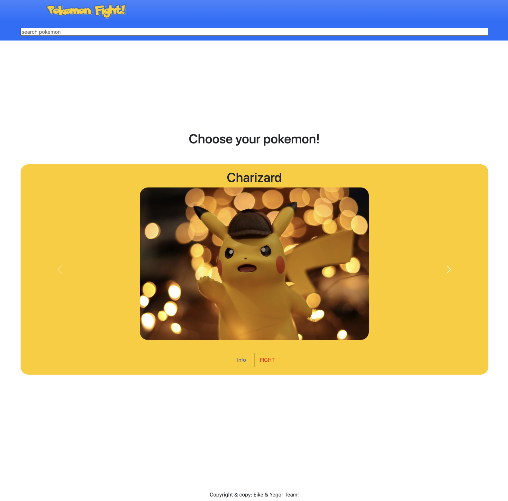

# Pokemon Game - A Pokemon Quartett



## Project Overview
Pokemon Game is an interactive web application where users can choose their favorite Pokemon and battle against randomly selected opponents. The project features a React-based frontend that connects to a backend API to fetch Pokemon data.

## Live Demo
The project is deployed and can be viewed at [https://poke-quartett.netlify.app/](https://poke-quartett.netlify.app/)

**Note:** Initial loading may take a few seconds as the server needs to wake up from sleep mode.

## Features
- Pokemon selection carousel
- Detailed Pokemon information cards
- Battle arena with fight mechanics
- Pokemon search functionality
- Responsive design for all devices
- Battle outcome calculation system

## Technologies Used
### Frontend
- React.js
- React Bootstrap
- React Router DOM
- JavaScript ES6+
- Bootstrap 5

### UI/UX
- Responsive design
- Custom CSS
- Bootstrap components
- Interactive carousel
- Card-based layouts

## Getting Started

### Prerequisites
- Node.js
- npm
- Backend API running (see related repositories)

### Installation
1. Clone the repository
   ```bash
   git clone https://github.com/eikemx/pokegame-frontend
   ```
2. Install dependencies
   ```bash
   npm install
   ```
3. Set up environment variables
   Create a `.env` file with:
   ```
   REACT_APP_PRODUCTION_URL=your_production_api_url
   REACT_APP_DEVELOPMENT_URL=your_development_api_url
   ```
4. Start the development server
   ```bash
   npm start
   ```
   The application will open at [http://localhost:3000](http://localhost:3000)

## Project Structure
```bash
pokegame-frontend/
├── src/
│ ├── components/
│ │ ├── AllPokemons.js
│ │ ├── Arena.js
│ │ ├── CalculateWinner.js
│ │ ├── Footer.js
│ │ ├── Header.js
│ │ ├── Pokedex.js
│ │ ├── Search.js
│ │ ├── searchResults.js
│ │ ├── SinglePokemon.js
│ │ └── Statistics.js
│ ├── media/
│ ├── App.css
│ ├── App.js
│ ├── bootstrap.min.css
│ ├── index.css
│ ├── index.js
│ └── serverURL.js
├── public/
└── README.md
```

## Scripts
- `npm start`: Runs the development server
- `npm build`: Builds the production application
- `npm eject`: Ejects from Create React App

## Features in Detail
1. **Pokemon Selection**
   - Interactive carousel of available Pokemon
   - Quick access to Pokemon details
   - Fight initiation options

2. **Battle System**
   - Stat-based battle calculations
   - Random opponent selection
   - Visual battle outcome display

3. **Pokemon Information**
   - Detailed stat cards
   - Pokemon images from PokeAPI
   - Type and ability information

4. **Search System**
   - Real-time Pokemon search
   - Name-based filtering
   - Dynamic results display

## Contact
- GitHub: [@eikemx](https://github.com/eikemx)
- Project collaborator: [@yegor](https://github.com/yegor)

## Acknowledgments
- WBS Coding School
- Project collaborator: yegormalakhov

---
*This project was created as part of the WBS Coding School Bootcamp curriculum.*